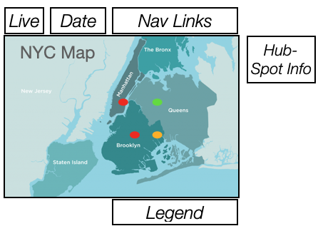

# NYC Shared Micromobility Visualization JavaScript-Project

### Abstract:
The primary purpose of the visualization will be to provide users with information on the number of bicycles/e-scooters used in different areas of NYC. A heatmap can be generated based on the frequency of bikes in nyc neighborhoods and overlayed with an interactive map of NYC. The goal would be to allow a user to to see a high level heatmap of bikes in NYC as well as zoom into particular areas of interest and see changes in patterns over time.  

### Functionality & MVPS
With this tool users will be able to:
- Fetch data from Micromobility Service API (e.g. Citi Bike, NYC Bicycle Counts, etc.)
- View  and scroll map of nyc with count of bicycle/e-scooter usage indicated through the presence of markers or heat map
- View additional information (e.g. ) of hub-spots for bicycles/e-scooters by clicking on selected ares of nyc map
- Provide toggle to visualization of past data

In addition, this project will include:
- A production README
- A description of the data collected, instructions for generating visualizations and interpreting results 

### Wireframe

- Main controls will be placed under upper left side of window
  - Live will display live data of bike & e-scooter count and availability
  - Date will display historical data available
- Nav Links will be placed upper right side of window with links to GitHub and LinkedIn
- A display of NYC will compromise the majority of the window
- A legend will be displayed below map to provide description of any elements on map color coded
- Hub-Spot information will be displayed on right side of map if user selects particular area of NYC

### Technologies, Libraries, APIs:
The project will be implemented with the following technologies:
- **Micromobility service & count API** to provide data of bicycles and e-scooters in NYC
- **D3js Library** to style map and create interactive zoom features
- **Webpack** to bundle source JavaScript code
- **npm** to manage project dependecies

###Implementation Timeline
**11/10/2022**
- [x] Review basics of fetching and practice with API's
- [ ] Down select bike & e-scooter data sources & data types
- [ ] Fetch data and display samples on console

**11/11/2022**
- [ ] Read documentation for d3js and learn to build map
- [ ] Learn basics of using google maps API
- [ ] Display map on a webpage 

**11/12/2022**
- [ ] Learn tools from d3js and google maps to customize maps
- [ ] Display map on a webpage with addition features / visualizations
- [ ] Fetch live data from data API and render sample on webpage

**11/13/2022**
- [ ] Develop map with live data points rendered onto map
- [ ] Explore and downselect features to visualize data over map

**11/14/2022**
- [ ] Create HTML skeleton for rest of webpage (nav bar, buttons, legend) 
- [ ] Explore and downselect method for visulization of specific markers on map

**11/15/2022**
- [ ] Implement method for creating visualization of data for specific markers on map 
- [ ] Add visualization of historic data
- [ ] Develop styling for webpage  

**11/16/2022**
- [ ] Continue styling of webpage 
- [ ] Troublshoot core features and add bonus features if time allows

**11/17/2022**
- [ ] Review project
- [ ] Deploy over GitHub/Heroku
